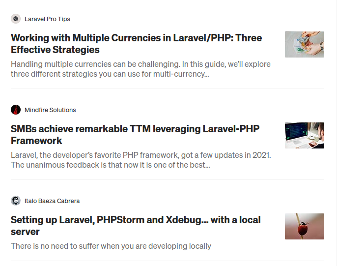
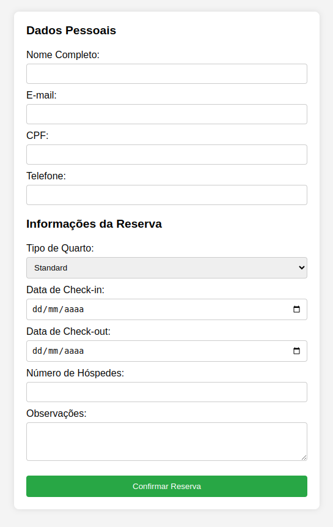

1- Faça um componente dinâmico em PHP que renderize cada item da lista de playlists, use a imagem como referência:

2- Faça um componente dinâmico em PHP que renderize cada item da lista de artigos, use a imagem como referência:

3- Faça um componente para inputs e outro para select e ao final crie um formulário de cadastro como sugerido:

